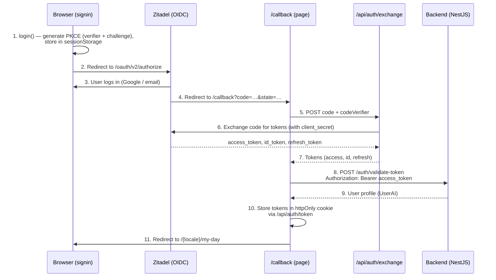

# Authentication Architecture

## Overview

Mentality uses **Zitadel** as the OIDC identity provider with the **Authorization Code + PKCE** flow. The frontend never handles `client_secret` — token exchange happens through a server-side API route.

The auth layer is built as a **provider-agnostic abstraction**. All application code interacts with a unified API (`authService` / `useAuth` / `getServerSession`), so switching to a different identity provider (Auth0, Keycloak, etc.) requires changes in only one file.

## Login Flow



## File Structure

```
lib/auth/
├── auth-provider.ts          # IAuthProvider interface
├── constants.ts              # AUTH_TOKEN_COOKIE, AUTH_COOKIE_MAX_AGE
├── index.ts                  # Entry point — exports authService
├── server.ts                 # getServerSession() for Server Components
└── providers/
    └── zitadel.ts            # ZitadelAuthProvider (current provider)

config/
└── zitadel.ts                # Zitadel OIDC configuration (env vars)

context/
└── AuthProvider.tsx           # React context — useAuth() hook

app/
├── callback/page.tsx          # OAuth callback handler
└── api/auth/
    ├── token/route.ts         # httpOnly cookie CRUD (GET/POST/DELETE)
    └── exchange/route.ts      # Server-side token exchange (keeps client_secret safe)

middleware.ts                  # Route protection, security headers, CSP

# Backward-compatibility re-exports (deprecated):
lib/auth-service.ts            # → re-exports from lib/auth
lib/get-server-session.ts      # → re-exports from lib/auth/server
```

## Usage

### Client Components — `useAuth()`

```tsx
import { useAuth } from '@/context/AuthProvider'

function MyComponent() {
  const { user, status, login, logout, getToken } = useAuth()

  if (status === 'loading') return <Spinner />
  if (status === 'unauthenticated') return <button onClick={login}>Sign In</button>

  return <div>Hello, {user?.name}</div>
}
```

### Server Components — `getServerSession()`

```tsx
import { getServerSession } from '@/lib/get-server-session'

export default async function Page() {
  const session = await getServerSession()
  if (!session) redirect('/auth')

  return <div>Hello, {session.user?.name}</div>
}
```

### API Requests — `getToken()`

```ts
import { authService } from '@/lib/auth'

const token = await authService.getToken()
// → valid accessToken (auto-refreshes if expired)

fetch('/api/something', {
  headers: { Authorization: `Bearer ${token}` },
})
```

## Token Management

| Token        | Storage         | Purpose                                    |
| ------------ | --------------- | ------------------------------------------ |
| accessToken  | httpOnly cookie | Sent to backend as `Authorization: Bearer` |
| idToken      | httpOnly cookie | Used for logout (`id_token_hint`)          |
| refreshToken | httpOnly cookie | Silent token refresh before expiry         |

**Cookie name:** `auth-tokens`
**Max age:** 30 days
**Flags:** `httpOnly`, `secure` (production), `sameSite=lax`

### Token Refresh

The `AuthProvider` sets a timer to automatically refresh the token 60 seconds before it expires. If the refresh fails, the user is logged out.

## Middleware Protection

`middleware.ts` handles:

1. **Route protection** — unauthenticated users on protected routes → redirect to `/auth`
2. **Token expiry check** — expired token without refresh token → redirect to `/auth`
3. **Auth redirect** — authenticated users on `/auth` → redirect to `/my-day`
4. **Admin guard** — non-admin users on `/admin/*` → redirect to `/profile`
5. **CSP headers** — Content-Security-Policy, X-Frame-Options, X-Content-Type-Options
6. **Locale handling** — NEXT_LOCALE cookie, Accept-Language fallback
7. **Request size limit** — 413 for POST/PUT/PATCH > 1MB

## Environment Variables

| Variable                        | Required | Description                           |
| ------------------------------- | -------- | ------------------------------------- |
| `NEXT_PUBLIC_ZITADEL_ISSUER`    | Yes      | Zitadel instance URL                  |
| `NEXT_PUBLIC_ZITADEL_CLIENT_ID` | Yes      | OIDC client ID                        |
| `ZITADEL_CLIENT_SECRET`         | Yes      | OIDC client secret (server-side only) |
| `NEXT_PUBLIC_BASE_URL`          | Yes      | App URL (for redirect URIs)           |
| `NEXT_PUBLIC_API_URL`           | Yes      | Backend API URL                       |

## Types

```ts
// Backend user (from /auth/validate-token)
type UserAI = {
  _id: string
  email: string
  name: string
  avatarUrl: string // Avatar from Zitadel userinfo (picture claim)
  role: UserRole // 'admin' | 'user'
  zitadelSub?: string // Zitadel subject ID
  createdAt: Date
}

// Frontend user (stored in context)
interface CustomUser {
  id: string
  name: string
  email: string
  image?: string // = avatarUrl from backend
  role?: UserRole
  isAIAuthorized?: boolean
}

// Session (server & client)
interface CustomSession {
  user?: CustomUser
  OAuthToken?: string // accessToken
  provider?: string // 'zitadel'
}
```

## Switching Auth Providers

To replace Zitadel with another provider (e.g., Auth0):

1. Create `lib/auth/providers/auth0.ts` implementing `IAuthProvider`
2. Change one line in `lib/auth/index.ts`:
   ```ts
   import { Auth0AuthProvider } from '@/lib/auth/providers/auth0'
   const provider: IAuthProvider = new Auth0AuthProvider()
   ```
3. Update `app/api/auth/exchange/route.ts` for the new provider's token endpoint
4. Update environment variables

Everything else — `useAuth()`, `getServerSession()`, middleware, all 50+ server components, all 40+ client components — stays unchanged.
