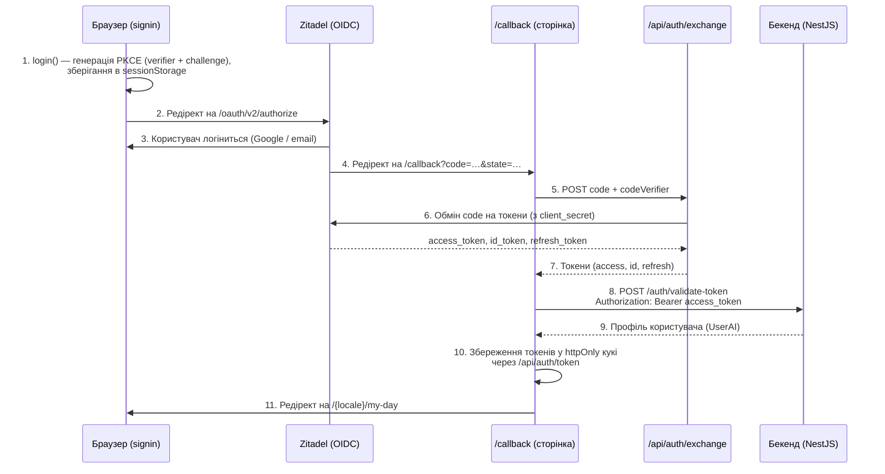

# Архітектура авторизації

## Огляд

Mentality використовує **Zitadel** як OIDC-провайдер із потоком **Authorization Code + PKCE**. Фронтенд ніколи не працює з `client_secret` — обмін токенів відбувається через серверний API-маршрут.

Шар авторизації побудований як **провайдер-агностична абстракція**. Весь код застосунку взаємодіє з єдиним API (`authService` / `useAuth` / `getServerSession`), тому заміна провайдера (Auth0, Keycloak тощо) потребує змін лише в одному файлі.

## Потік логіну



## Структура файлів

```
lib/auth/
├── auth-provider.ts          # IAuthProvider інтерфейс
├── constants.ts              # AUTH_TOKEN_COOKIE, AUTH_COOKIE_MAX_AGE
├── index.ts                  # Вхідна точка — експортує authService
├── server.ts                 # getServerSession() для серверних компонентів
└── providers/
    └── zitadel.ts            # ZitadelAuthProvider (поточний провайдер)

config/
└── zitadel.ts                # Конфігурація Zitadel OIDC (env-змінні)

context/
└── AuthProvider.tsx           # React-контекст — хук useAuth()

app/
├── callback/page.tsx          # Обробник OAuth-колбеку
└── api/auth/
    ├── token/route.ts         # CRUD httpOnly кукі (GET/POST/DELETE)
    └── exchange/route.ts      # Серверний обмін токенів (зберігає client_secret)

middleware.ts                  # Захист маршрутів, безпекові заголовки, CSP

# Зворотна сумісність (deprecated):
lib/auth-service.ts            # → ре-експорт з lib/auth
lib/get-server-session.ts      # → ре-експорт з lib/auth/server
```

## Використання

### Клієнтські компоненти — `useAuth()`

```tsx
import { useAuth } from '@/context/AuthProvider'

function MyComponent() {
  const { user, status, login, logout, getToken } = useAuth()

  if (status === 'loading') return <Spinner />
  if (status === 'unauthenticated') return <button onClick={login}>Увійти</button>

  return <div>Привіт, {user?.name}</div>
}
```

### Серверні компоненти — `getServerSession()`

```tsx
import { getServerSession } from '@/lib/get-server-session'

export default async function Page() {
  const session = await getServerSession()
  if (!session) redirect('/auth')

  return <div>Привіт, {session.user?.name}</div>
}
```

### API-запити — `getToken()`

```ts
import { authService } from '@/lib/auth'

const token = await authService.getToken()
// → валідний accessToken (автоматично оновлюється якщо протерміновано)

fetch('/api/something', {
  headers: { Authorization: `Bearer ${token}` },
})
```

## Управління токенами

| Токен        | Сховище       | Призначення                                     |
| ------------ | ------------- | ----------------------------------------------- |
| accessToken  | httpOnly кукі | Надсилається бекенду як `Authorization: Bearer` |
| idToken      | httpOnly кукі | Використовується для логауту (`id_token_hint`)  |
| refreshToken | httpOnly кукі | Тихе оновлення токена до закінчення терміну     |

**Назва кукі:** `auth-tokens`
**Термін дії:** 30 днів
**Прапорці:** `httpOnly`, `secure` (production), `sameSite=lax`

### Оновлення токена

`AuthProvider` встановлює таймер для автоматичного оновлення токена за 60 секунд до закінчення терміну дії. Якщо оновлення не вдається — користувач виходить з системи.

## Захист маршрутів (Middleware)

`middleware.ts` забезпечує:

1. **Захист маршрутів** — неавтентифіковані користувачі на захищених маршрутах → редірект на `/auth`
2. **Перевірка терміну токена** — протермінований токен → серверний рефреш через Zitadel; якщо немає refresh токена → редірект на `/auth`
3. **Редірект з логіну** — автентифіковані користувачі на `/auth` → редірект на `/my-day`
4. **CSP-заголовки** — Content-Security-Policy, X-Frame-Options, X-Content-Type-Options
5. **Локалізація** — кукі NEXT_LOCALE, фолбек Accept-Language
6. **Обмеження розміру запиту** — 413 для POST/PUT/PATCH > 1MB

> **Примітка:** Контроль доступу за ролями (напр. адмін-маршрути) виконується серверно в `layout.tsx`, а не в middleware.

## Змінні оточення

| Змінна                          | Обов'язкова | Опис                               |
| ------------------------------- | ----------- | ---------------------------------- |
| `NEXT_PUBLIC_ZITADEL_ISSUER`    | Так         | URL інстансу Zitadel               |
| `NEXT_PUBLIC_ZITADEL_CLIENT_ID` | Так         | OIDC client ID                     |
| `ZITADEL_CLIENT_SECRET`         | Так         | OIDC client secret (тільки сервер) |
| `NEXT_PUBLIC_BASE_URL`          | Так         | URL застосунку (для redirect URI)  |
| `NEXT_PUBLIC_API_URL`           | Так         | URL бекенд API                     |

## Типи

```ts
// Користувач з бекенду (з /auth/validate-token)
type UserAI = {
  _id: string
  email: string
  name: string
  avatarUrl: string // Аватар з Zitadel userinfo (picture claim)
  role: UserRole // 'admin' | 'user'
  zitadelSub?: string // Ідентифікатор суб'єкта Zitadel
  createdAt: Date
}

// Користувач на фронтенді (зберігається в контексті)
interface CustomUser {
  id: string
  name: string
  email: string
  image?: string // = avatarUrl з бекенду
  role?: UserRole
  companyId?: string
  companyRole?: CompanyRole
  isAIAuthorized?: boolean
}

// Сесія (сервер та клієнт)
interface CustomSession {
  user?: CustomUser
  OAuthToken?: string // accessToken
  provider?: string // 'zitadel'
  error?: SessionError
  expires?: string
}
```

## Заміна провайдера авторизації

Щоб замінити Zitadel іншим провайдером (наприклад Auth0):

1. Створити `lib/auth/providers/auth0.ts`, що реалізує `IAuthProvider`
2. Змінити один рядок у `lib/auth/index.ts`:
   ```ts
   import { Auth0AuthProvider } from '@/lib/auth/providers/auth0'
   const provider: IAuthProvider = new Auth0AuthProvider()
   ```
3. Оновити `app/api/auth/exchange/route.ts` під ендпоінт нового провайдера
4. Оновити змінні оточення

Все інше — `useAuth()`, `getServerSession()`, middleware, 50+ серверних компонентів, 40+ клієнтських компонентів — залишається без змін.
